# Backend App Development Diary
### by Pavel Konyakhin

> Backend part development Diary of **MusicFlow** project, 
> a music streaming service, inspired by Spotify.  
> **Main Stack**: NestJS • TypeScript (strict) • Supabase • Jamendo API

---

## Entry #1
**createdAt:** 09 May 2026, 12:00

### Idea
I need to start from something. Before start coding, I need to decide an architecture as for the whole project as well as for backend.  
I decided to create a detailed plan and schemas to move forward step-by-step.

Main decisions and chosen approaches on start:
- [x] **Backend**: NestJS + TypeScript (strict mode and strict types, documenting each, and no `any`);
- [x] **DataBase for App**: **Supabase** (Free Tier), working via `@supabase/supabase-js`. I decided to abandon **Prisma** in favor of the native **Supabase** client: fewer layers of abstraction, direct access to RLS (row level sec - this means that User has access to the rows, where `user_id` equal to their `id`) and Auth. This is because **Prisma** connects via direct connection (PORT=5432) as a `postgres` role, which ignores RLS, and to make it work, I'd had set `SET LOCAL`; besides - less code, and there is no need to add `.where({})` in each method;
- [x] **Music data** (as suggested): **Jamendo API v3** (Free and w/o DRM)
- [x] **_Suggest to the Team_**: create two separate repos: `musicflow-backend` и `musicflow-frontend` within a single Organization on GitHub.
- [x] **Branch strategy**: `main` (as prod) ← `dev` ← `feature/*`

### Frontend diagram

<div align="center">
  
</div>

### Backend diagram

<div align="center">
  
</div>


### Implementation
Defined the project structure: organized into `auth`, `users`, `music`, and `favorites` modules, with common utilities and a global Supabase wrapper.

### Issues
None

---

## Entry #2

**createdAt:** 09 May 2026, 14:20

### Idea
Configure external services (e.g.: Supabase, S3, Jamendo API) before start coding.

### Implementation

**Supabase:**
- [x] Created: `music_flow` project in `eu-central-1 (Frankfurt)` region, chose Europe over Asia-Pacific to minimize latency;
- [x] Security configuration: enabled the `Data API` and automatic RLS, while disabling `"Automatically expose new tables"` for tighter manual control;
- [x] Skipped GitHub-to-Supabase integration, as the backend part repository belongs to a third-party Organization, which makes complex permission management impractical;
- [x] Obtained: `SUPABASE_URL` and `SUPABASE_SERVICE_ROLE_KEY` out of `Settings` → `API`

**Jamendo:**
- [x] Registered at [Jamendo](https://developer.jamendo.com) and obtained `CLIENT_ID`;
- [x] Verified the API via CURL-requests to `/tracks`, `/albums`, and `/artists` return valid JSON.

**Environment Variables:**
Сформировал `.env` файл со всеми необходимыми переменными. Сразу вынес `CORS_ORIGINS` в `.env` - чтобы при деплое на GitHub Pages не менять код, а только переменную окружения.
- [x] Configured the `.env` file with all required variables.  
- [x] Moved `CORS_ORIGINS` (`http://localhost:4200` as strings-list) to `.env` to ensure that deploying to GitHub Pages only requires updating the environment variable, rather than modifying the code.

```dotenv
# Server
PORT=3000

# CORS
CORS_ORIGINS=http://localhost:4200

# Supabase
SUPABASE_URL=https://***.supabase.co
SUPABASE_SERVICE_ROLE_KEY=<your_supabase_service_role_key>
SUPABASE_ANON_KEY=<your_supabase_anon_key>

# JWT
JWT_SECRET=<your_jwt_secret_frase_generated>
JWT_EXPIRES_IN=7d

# Jamendo
JAMENDO_CLIENT_ID=<your_jamendo_client_id>
JAMENDO_BASE_URL=https://api.jamendo.com/v3.0
```

### Issues
- [x] Hidden `SUPABASE_SERVICE_ROLE_KEY`: Could not locate it immediately as it is tucked away behind the Reveal button in `Settings` → `API` rather than being displayed on the 
   Project's Home page;
- [x] Accidentally typed `SUPABASE__SERVICE_ROLE_KEY` (double underscore), which would have caused `@nestjs/config` to fail to locate the variable;
- [x] Fixed: Reserved Alias! I discovered that `@types` may not be used as a path alias, because it is reserved by TypeScript. Thus, I renamed the alias to `@db-types` and updated 
  `tsconfig.json` accordingly.

---

## Entry #3

**createdAt:** 09 May 2026, 14:50

### Idea
Init NestJS project and install necessary dependencies.

### Implementation

Init project:
```bash
nest new . --strict --skip-git
```
- Param `--skip-git` required, otherwise Nest would fail already initiated `.git`.
- Param `--strict` includes strict typing for TypeScript.

**Packages installed**:
- [x] `@supabase/supabase-js` - client to work with `Supabase DB`, `Auth`, `Storage`
- [x] `@nestjs/config` - work with `.env` variables (already includes `dotenv`);
- [x] `@nestjs/throttler` - rate limiting, prevent spam;
- [x] `@nestjs/jwt`, `passport`, `passport-jwt`, `@nestjs/passport` - JWT auth;
- [x] `@nestjs/axios`, `axios` - HTTP client to make requests to `Jamendo API`;
- [x] `@nestjs/cache-manager`, `cache-manager` - to cache responses;
- [x] `nestjs-pino`, `pino-http` - structured JSON logs;
- [x] `class-validator`, `class-transformer` - validation and transformation of `DTO`
- [x] `@nestjs/swagger` - auto-documenting `API`

**Generated** structure via `Nest CLI`:
- for: `supabase`, `auth`, `users`, `music`, `favorites`:
```bash
nest g module/service/controller
```
- for: common utilities:
```shell
nest g guard/interceptor/filter/decorator
```

**Configured** path aliases in `tsconfig.json` (`@auth/*`, `@common/*`, `@db-types/*` etc.), and installed `tsconfig-paths` to work aliases in runtime.

### Issues
- `nest new .` was failing with error, conflicting with present `README.md` - temporarily renamed it;
- `Nest CLI` has created an extra nested level for `guard/interceptor/filter/decorator` (`guards/jwt-auth/jwt-auth.guard.ts` - instead of `guards/jwt-auth.guard.ts`) - fixed;
- Alias `@types/*` conflicts with TypeScript reservednamespace - renamed to `@db-types/*`

---

## Entry #4

**createdAt:** 09 May 2026

### Idea
Configuring the application entry point and global settings.

### Implementation

**`main.ts`** - configured as follows:
- [x] Global prefix `/api/v1` for all routes;
- [x] `ValidationPipe` with `whitelist: true`, `forbidNonWhitelisted: true`, `transform: true`;
- [x] `CORS` with `origins` from env variables (by `.split(',')` to support multiple origins);
- [x] Swagger dcumentation on `/api/docs` with `Bearer Auth` support;

**`app.module.ts`** - connected:
- [x] `ConfigModule.forRoot({ isGlobal: true })`, that `ConfigService` would be accessible globally without repeated imports;

### Issues
- Application failed with `UnknownElementException` on `ConfigService`, because `ConfigModule` was not added to `AppModule`. Add `ConfigModule.forRoot()` to `imports: []`

---

## Entry #5

**createdAt:** 09 May 2026

### Idea
Create a typed service to work with `Supabase` and generate TypeScript types from the real `DB schema`, to completely get rid of types `any`.

### Implementation

**DB Schema** - created three tables in `Supabase SQL Editor`:
- `profiles` - extension `auth.users`, contains: 
  - `username`, 
  - `full_name`, 
  - `avatar_url`
- `favorites` - favorite user' tracks, contains: `track_id` and `track_data` JSON to cache data)
- `listening_history` - keeps listened tracks history

I enabled `RLS` on all tables and set policies that the `user` sees and manages only their own data.

**Types generation:**
```bash
supabase gen types typescript --project-id uwazcuzqtmozmhwiedap --schema public > src/types/database.types.ts
```
Thus, I have received complete TypeScript types (`Row`, `Insert`, `Update`) for all created in Supabase tables in one file `src/types/database.types.ts`.

**`supabase.service.ts`** - a wrapper over `Supabase` Client:
- uses the `service_role` key (grants full access to the DB, bypasses `RLS`);
- `autoRefreshToken: false`, `persistSession: false` - server mode;
- `client` typed via `SupabaseClient<Database>` - removed temp `any`;
- use method `getOrThrow()` instead of `get()` - which guarantees it fails on start if variable wis not found;

**`supabase.module.ts`** - marked and decorated with `@Global()` which exports `SupabaseService` globally and is available in all modules without explicit import...

### Issues
- ESLint complained about `SupabaseClient<any>` - I temporarily set `any` as a placeholder before generating types, then replaced it with `SupabaseClient<Database>`;
- Supabase CLI can't be installed via `npm install -g` - thus, I installed it via Homebrew: `brew install supabase/tap/supabase`;

---

## Entry #6

**createdAt:** 09 May 2026

### Idea
Implement `Auth` module: `sign-up` (registration), `sign-in` (entry), `getMe` (get current user). I broke the task into subtasks and implemented them one by one.

### Implementation

**Subtasks**:
1. **DTO** (`sign-up.dto.ts`, `sign-in.dto.ts`) - Validating input data via `class-validator`. Swagger annotations via `@ApiProperty`;
2. **JWT strategy** (`jwt.strategy.ts`) - validates the _token_, retrieves the user's profile from Supabase, and returns it to `request.user`;
3. **JWT Guard** (`jwt-auth.guard.ts`) - extends `AuthGuard('jwt')` from _Passport_, secures routes;
4. **Auth service** (`auth.service.ts`) - business logic:
  - `signUp`: check username's availability -> user creation in Supabase Auth -> profile creation in `profiles` table (with a rollback if the profile was not created);
  - `signIn`: authentication via Supabase -> get user's profile -> JWT generation;
  - `getMe`: Getting a profile by `userId` from a token;
5. **`@CurrentUser()` decorator** (`current-user.decorator.ts`) - retrieves `request.user` which Passport puts after validating the JWT;
6. **Auth controller** (`auth.controller.ts`) - three endpoints created: `POST /sign-up`, `POST /sign-in`, `GET /me`;
7. **Auth module** (`auth.module.ts`) - I put everything together using `JwtModule.registerAsync()` and `PassportModule`.

### Issues
- `JwtService` was not resolved - `JwtModule` was not included in `AuthModule`. So, I added `JwtModule.registerAsync()`;
- `expiresIn` in `jwtService.sign()` and `JwtModule` expects the `StringValue` type, not just `string`, so I imported `StringValue` from `ms` and added `as StringValue` Type assertion;
- The CLI-generated `@CurrentUser()` decorator was a stub via `SetMetadata` - replaced it with `createParamDecorator`, extracting `request.user`
- Incidentally imported `Strategy` from `passport` instead of from `passport-jwt` - fixed the import.

### Result
I started application and tested it works via `Swagger UI`: for instance, `POST /api/v1/auth/sign-up` returned an _accessToken_ and _user data_. The user appeared in Supabase 
`Dashboard` -> `Authentication` -> `Users` and in the profiles table.

---

## Entry #7 
**createdAt:** 10 May 2026, 23:00

### Idea
Users module is the next logical step after Auth. A user needs to be able to view their profile, update it, and upload an avatar. Also decided to finish the module completely 
before moving on, including avatar upload via Supabase Storage (S3 Bucket).

### Implementation

**Profile endpoints** (`src/users/`):
- Created `UpdateProfileDto` with optional `username` and `full_name` fields
- Implemented `UsersService` with three methods: `getProfile`, `updateProfile`, `deleteAccount`
- Added `UsersController` with `GET /profile`, `PATCH /profile`, `DELETE /account`, all protected by `JwtAuthGuard`
- Added `UsersModule` with `UsersService` exported for potential use in other modules

**Supabase Storage policies** (via SQL Editor):
- Created four RLS policies on `storage.objects` for the `avatars` bucket: public SELECT, and user-scoped INSERT, UPDATE, DELETE based on `storage.foldername(name)[1]` matching `auth.uid()`

**Avatar upload** (`POST /users/profile/avatar`):
- Added `uploadAvatar` method in `UsersService` uploads avatar file to Supabase Storage at path `{userId}/avatar.{ext}`, then updates `avatar_url` in the `profiles` table
- Used `FileInterceptor` from `@nestjs/platform-express` and `ParseFilePipe` with `MaxFileSizeValidator` (2MB) and `FileTypeValidator` (jpeg/jpg/png only)
- Normalized to lowercase file extension to avoid casing inconsistencies

### Issues & Solutions

**Issue:** `@types/multer` types for `Express.Multer.File` were not available.
**Solution:** Installed `@nestjs/platform-express` and `@types/multer` as dev dependency.

**Issue:** File extension stored in uppercase (e.g. `.JPG`) depending on original filename.
**Solution:** Applied `.toLowerCase()` to the extracted extension before constructing the storage path.

**Issue:** Supabase Storage UI no longer supports creating custom policies via the Dashboard form (as of May 2026).
**Solution:** Created all four Storage RLS policies directly via SQL Editor, same approach used for table policies.

---

## Entry 8
**createdAt:** 11 May 2026, 12:10

### Thought
The Users module needed a complete avatar management system — not just upload, but a proper lifecycle: default avatars on registration, user upload with overwrite, and deletion with fallback to a default. Decided to finish this properly before moving on to the Music module.

### Implementation

**Default avatars:**
- Created a separate `default_avatars` bucket in Supabase Storage (Public, SVG only, 1MB limit)
- Added a public read RLS policy for the bucket via SQL Editor
- `getRandomDefaultAvatarUrl()` fetches the file list dynamically from the bucket — no hardcoded count
- Generated and uploaded 10 music-themed SVG icons for `default_avatars`

**Avatar lifecycle:**
- `POST /profile/avatar` uploads user's image as `avatar.jpg` (fixed filename + `upsert: true` ensures the same file is always overwritten, no duplicates)
- `DELETE /profile/avatar` removes custom avatar from Storage and assigns a new random from `default-avatars/`
- `signUp` in `AuthService` updated to assign a random default avatar at registration instead of `null`

**Files changed:** `users.service.ts`, `users.controller.ts`, `auth.service.ts`, `auth.module.ts`

### Problems & Solutions

**Problem:** Avatar uploaded as `.JPG` (uppercase) created a duplicate file instead of overwriting the previous one.
**Solution:** Fixed filename to always be `avatar.jpg` regardless of original file extension.

**Problem:** Hardcoded `DEFAULT_AVATARS_COUNT = 10` would break if more avatars were added later.
**Solution:** Replaced with a dynamic `.list()` call to the `default_avatars` bucket which always reflects the actual number of files in the folder.
